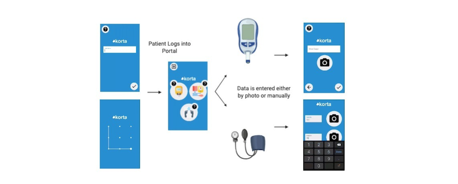
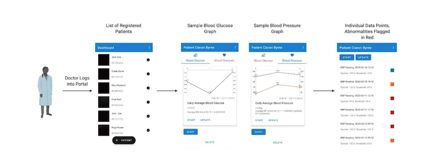
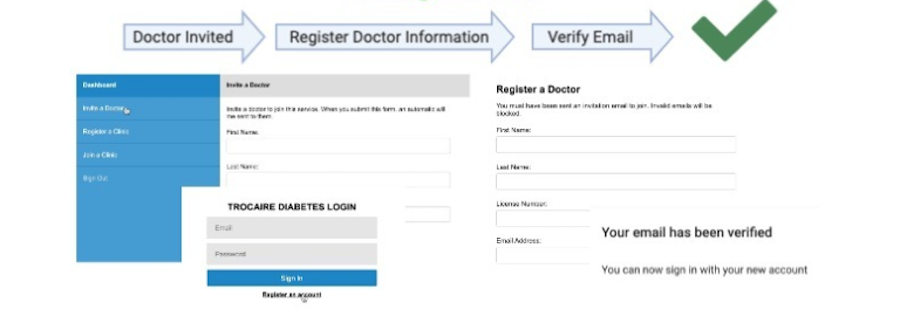

# Trocaire Diabetes Management App Collection

The goal of this project is to provide tools to enable patients with diabetes to
communicate their blood sugar level and blood pressure test results. These test
results data must be visualised for doctors so that they can track the health
and wellbeing of their patients and take actions if necessary.

## Client Requirements

In countries like Somalia, in which poor health literacy is prevalent, diabetic
patients are unable to attend frequent doctor appointments. Diabetes mellitus is
a chronic condition, predominantly affecting the pancreas, that fails to
adequately produce insulin. This results in dangerously high blood sugar levels.
These spikes often cause comorbidities such as diabetic ulcers, blindness and
hypertension. As these can rapidly develop, regularly scheduled doctor
appointments are highly recommended to maximise patient care. However, poor
online infrastructure in Somalia has resulted in poor patient compliance for
these appointments as there is currently no digital platform for doctors to
track and monitor their patients.

## Solution

To combat this problem we have developed an app entitled "Korta", that aims to
resolve the disconnect between patients and doctors. This results in an
improvement in both patient compliance and overall care. Korta is a mobile and
web-based app designed for both diabetic patients and their doctors. Using the
app, doctors can create individual patient profiles to allow for the ability to
automatically and securely upload patient data with minimal literary
requirements. The biometric data is displayed graphically for the clinician with
any abnormalities highlighted. Notifications alert the doctor to contact a
patient should they need to be called in for an appointment.

Overall, a platform has been created to track and monitor diabetic patients in
Somalia, thereby improving patient care. The app has the potential to be
translated to other regions or to monitor additional biometrics like
cholesterol.

Finally, the app is particularly relevant to COVID-19 (of which diabetes is a
large risk factor), as allowing doctors to remotely identify and monitor these
high-risk patients without the need for an in-person assessment would reduce a
diabetic patient's risk of contracting the virus.

### Patient Android App

Allows patients to input readings. Designed for illiterate users. Readings can
be inputted manually or through optical character recognition.

### Doctor Android App

Allows doctors to sign-up patients and monitor them. Includes a visualisation
and alert system, patient follow-up reminders and patient profiles.

### Administrative Dashboard Web App

Allows signing-up doctors, clinics and admins. This dashboard serves both
administrators and doctors. Includes an email verification procedure.

### Technology Description: Front End

-   Android Studio for the doctor and patient apps.

-   Google Vision API and OpenCV for OCR.

-   MPAndroidChart for visualisations.

-   Firebase for authentication.

### Technology Description: Back End

-   Node.js for the server.

-   Express to handle requests.

-   MySQL as the database.

-   Developed using TypeScript.

-   Firebase for authentication.

-   Azure Blob Storage to store images.

### Screenshots

**Patient App**

**Doctor App**

**Web App**

## Team

Developed by a team comprising of Senior Sophister, BA (Mod.) Computer Science
students and MSc Bioengineering students at Trinity College, Dublin.

## Installation  

Please get in touch with one of the contributors to discuss installation.

